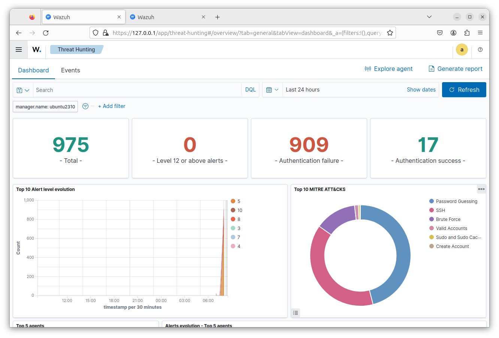
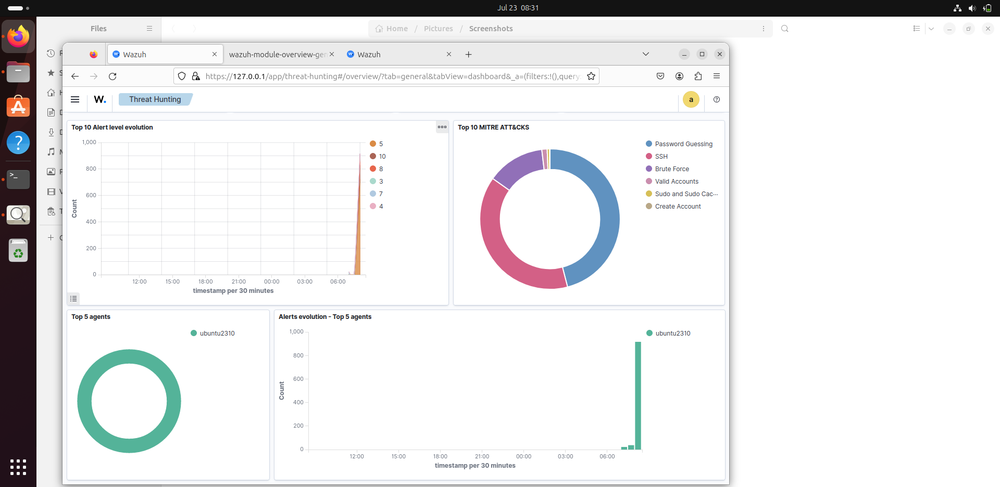

# Wazuh SIEM Deployment & Automated Brute Force Detection

## Objective
Deploy a real SIEM (Wazuh) on the lab environment and compare automated detection against the manual log analysis performed in earlier projects demonstrating
how a SIEM turns raw logs into actionable, classified alerts.

## Deployment
Installed the full Wazuh stack (indexer, manager, dashboard) on the Ubuntu lab VM using the official all in one installer.

```bash
curl -sO https://packages.wazuh.com/4.9/wazuh-install.sh
sudo bash ./wazuh-install.sh -a
```

**Note**: Ubuntu 23.10 had reached end-of-life during this project, causing package repository failures. Resolved by redirecting APT sources to the
`old-releases.ubuntu.com` archive before proceeding with dependency installs.

## Configuration
By default, the manager did not explicitly monitor `/var/log/auth.log` (the file used in prior manual investigations). Added it directly to the 
manager's local file monitoring configuration:

```xml
<localfile>
  <log_format>syslog</log_format>
  <location>/var/log/auth.log</location>
</localfile>
```

```bash
sudo systemctl restart wazuh-manager
```

## Test — Re-running a Known Attack
Re-ran the same SSH brute-force simulation used in earlier projects, to compare Wazuh's automated detection against the manual log analysis performed previously.

```bash
hydra -l ubuntu -P /usr/share/wordlists/rockyou.txt ssh://192.168.56.103
```

## Results

Wazuh's Threat Hunting dashboard automatically surfaced:

| Metric | Count |
|---|---|
| Total events | 975 |
| Authentication failures | 909 |
| Authentication successes | 17 |
| Level 12+ (critical) alerts | 0 |





**Comparison to manual investigation (Project 03)**: the automated count (909 authentication failures) closely matched the manual count obtained earlier
via `grep`/`tail` (906 lines) — validating that Wazuh's automatic detection is consistent with manual forensic analysis, while requiring a fraction
of the time and effort.

**MITRE ATT&CK classification**: Wazuh automatically categorized the attack activity under real MITRE ATT&CK techniques, without any manual tagging:
- Password Guessing (majority of events)
- SSH
- Brute Force
- Valid Accounts / Sudo and Sudo Caching / Create Account (minor volume)

**Zero critical (Level 12+) alerts** confirmed — consistent with the earlier manual finding that the attack generated high volume but did not
result in a successful compromise.

## Assessment
This project validates the manual log analysis performed in Project 03 using an independent, automated tool. The near-identical event count 
between manual `grep` analysis and Wazuh's automatic detection confirms both methods correctly captured the same real-world activity. The key advantage
of the SIEM is speed and scale: what took manual `tail`/`grep` commands and careful reading to reconstruct, Wazuh presented as an immediate
visual summary with proper threat classification (MITRE ATT&CK), without any manual correlation work.

## Recommendation
In a production environment, this configuration would benefit from:
1. **Automated alerting** (e.g. email/Slack notification) when authentication-failure volume crosses a defined threshold, rather than requiring manual
    dashboard review
3. **Correlation rules** tying repeated authentication failures to automatic temporary IP blocking (fail2ban integration)
4. Extending monitoring to additional log sources beyond `auth.log` for broader visibility

## What I Learned
- A SIEM's value isn't just detection it's *speed and classification*. The underlying evidence was identical to my manual analysis, but Wazuh surfaced
   it instantly and mapped it to an industry-standard framework (MITRE ATT&CK) automatically
- Default SIEM configurations don't automatically monitor every relevant log file — verifying and explicitly configuring log sources is a necessary step,
  not an assumption
- Cross-validating an automated tool's output against manual analysis (comparing 909 vs. 906) is a valuable practice — it builds confidence that both
  the manual method and the tool are working correctly, rather than blindly trusting either one.
